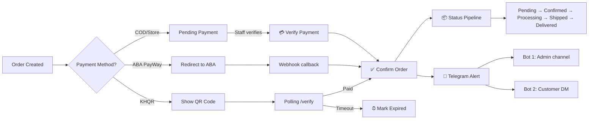
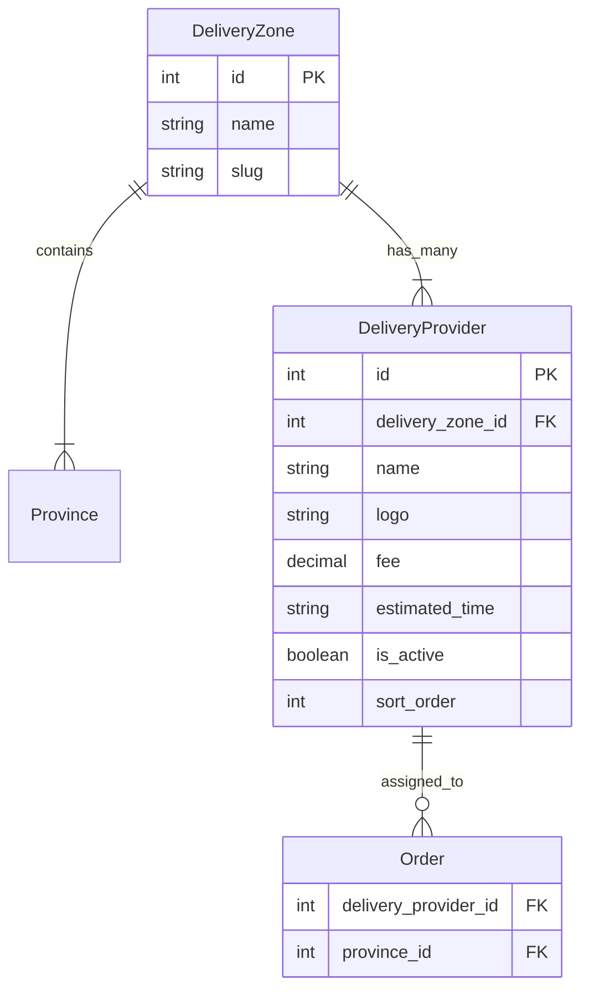
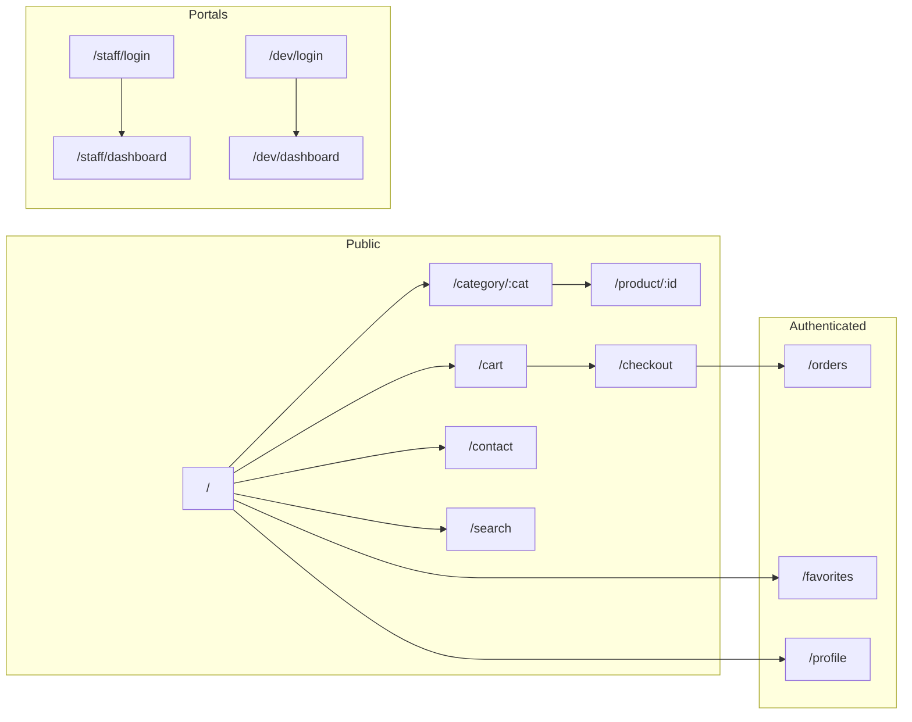
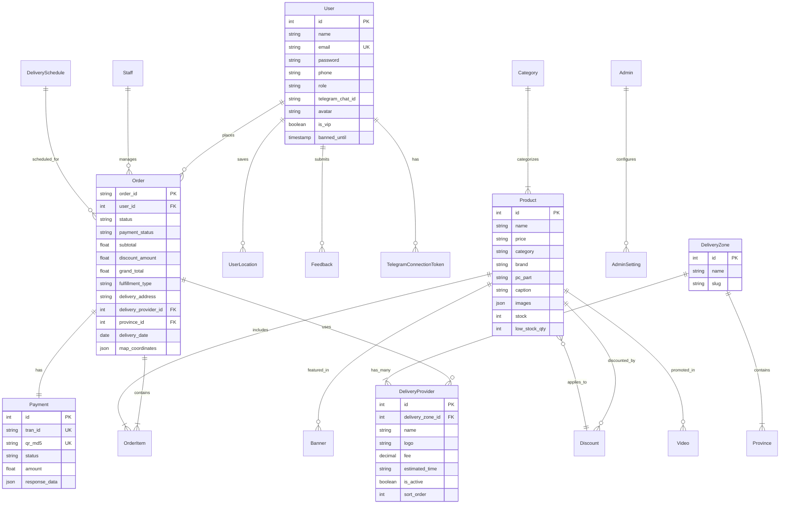
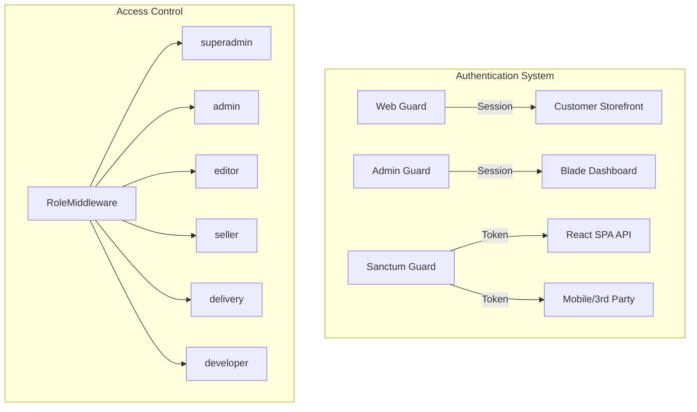

<!-- ============================================================
     TRONMATIX COMPUTER — Full-Stack E-Commerce README
     ============================================================ -->

<div align="center">

<!-- ─── ANIMATED HERO SVG ───────────────────────────────────── -->
<svg viewBox="0 0 900 300" width="100%" height="auto" style="max-width:900px" xmlns="http://www.w3.org/2000/svg">
  <defs>
    <linearGradient id="heroGrad" x1="0%" y1="0%" x2="100%" y2="100%">
      <stop offset="0%"   stop-color="#F97316" />
      <stop offset="50%"  stop-color="#FB923C" />
      <stop offset="100%" stop-color="#F97316" />
    </linearGradient>
    <linearGradient id="heroGrad2" x1="0%" y1="0%" x2="100%" y2="0%">
      <stop offset="0%"   stop-color="#F97316" stop-opacity="0" />
      <stop offset="50%"  stop-color="#F97316" stop-opacity="0.6" />
      <stop offset="100%" stop-color="#F97316" stop-opacity="0" />
    </linearGradient>
    <filter id="glow">
      <feGaussianBlur stdDeviation="3" result="coloredBlur"/>
      <feMerge>
        <feMergeNode in="coloredBlur"/>
        <feMergeNode in="SourceGraphic"/>
      </feMerge>
    </filter>
  </defs>
  <circle cx="450" cy="110" r="80" fill="url(#heroGrad2)" opacity="0.3"></circle>
  <text x="130" y="150" font-size="72" font-family="monospace" font-weight="bold"
        fill="url(#heroGrad)" filter="url(#glow)" text-anchor="middle">⚡</text>
  <text x="360" y="130" font-size="52" font-family="'Segoe UI','Rajdhani',sans-serif"
        font-weight="900" fill="#F97316" filter="url(#glow)">TRONMATIX</text>
  <text x="360" y="172" font-size="22" font-family="'Segoe UI','Rajdhani',sans-serif"
        fill="#9CA3AF" font-weight="600">Computer E-Commerce Platform</text>
  <text x="360" y="200" font-size="16" font-family="'Kdam Thmor Pro','Rajdhani',sans-serif"
        fill="#6B7280" font-style="italic">ប្រព័ន្ធលក់គ្រឿងកុំព្យូទ័រគ្រប់គ្រងពេញលេញ</text>
  <line x1="40" y1="230" x2="860" y2="230" stroke="url(#heroGrad2)" stroke-width="2" stroke-linecap="round" />
  <circle cx="450" cy="230" r="5" fill="#F97316"></circle>
  <g transform="translate(0, 15)">
    <rect x="40"   y="235" width="120" height="28" rx="14" fill="#1F2937" />
    <text x="100" y="254" font-size="12" fill="#34D399" text-anchor="middle" font-family="monospace">React 18 SPA</text>
    <rect x="175"  y="235" width="130" height="28" rx="14" fill="#1F2937" />
    <text x="240" y="254" font-size="12" fill="#F97316" text-anchor="middle" font-family="monospace">Laravel 12 API</text>
    <rect x="320"  y="235" width="110" height="28" rx="14" fill="#1F2937" />
    <text x="375" y="254" font-size="12" fill="#60A5FA" text-anchor="middle" font-family="monospace">PostgreSQL</text>
    <rect x="445"  y="235" width="110" height="28" rx="14" fill="#1F2937" />
    <text x="500" y="254" font-size="12" fill="#A78BFA" text-anchor="middle" font-family="monospace">Blade Admin</text>
    <rect x="570"  y="235" width="120" height="28" rx="14" fill="#1F2937" />
    <text x="630" y="254" font-size="12" fill="#FBBF24" text-anchor="middle" font-family="monospace">ABA PayWay</text>
    <rect x="705"  y="235" width="110" height="28" rx="14" fill="#1F2937" />
    <text x="760" y="254" font-size="12" fill="#38BDF8" text-anchor="middle" font-family="monospace">Telegram</text>
  </g>
</svg>

<br />

[](https://react.dev)
[](https://vite.dev)
[](https://laravel.com)
[](https://php.net)
[](https://postgresql.org)
[](https://tailwindcss.com)

[](https://laravel.com/docs/sanctum)
[]()
[](https://leafletjs.com)
[]()
[](LICENSE)

</div>

<svg viewBox="0 0 800 20" width="100%" height="20" xmlns="http://www.w3.org/2000/svg">
  <defs>
    <linearGradient id="divGrad1" x1="0%" y1="0%" x2="100%" y2="0%">
      <stop offset="0%" stop-color="#F97316" stop-opacity="0" />
      <stop offset="50%" stop-color="#F97316" stop-opacity="0.8" />
      <stop offset="100%" stop-color="#F97316" stop-opacity="0" />
    </linearGradient>
  </defs>
  <line x1="0" y1="10" x2="800" y2="10" stroke="url(#divGrad1)" stroke-width="2" stroke-dasharray="8 6"/>
  <circle cx="400" cy="10" r="4" fill="#F97316"></circle>
</svg>

<br />

# 📋 Table of Contents

1. [Overview](#-overview)
2. [Architecture](#-architecture)
3. [Tech Stack](#️-tech-stack)
4. [Features](#-features)
5. [Purchase Flow](#-purchase-flow--payment)
6. [Delivery Provider System](#-delivery-provider-system)
7. [Khmer Localization](#-khmer-localization-ភាសាខ្មែរ)
8. [Design System](#-design-system)
9. [Pages & Routes](#-pages--routes)
10. [Database Schema](#️-database-schema)
11. [API Endpoints](#-api-endpoints)
12. [Setup Guide](#-setup-guide)
13. [Project Structure](#-project-structure)
14. [Security](#-security)
15. [Screenshots](#-screenshots)
16. [License](#-license)

---

## 📖 Overview

**Tronmatix Computer** is a full-stack e-commerce platform built for a computer and PC parts shop in **Phnom Penh, Cambodia**. It serves three distinct user groups through a single, cohesive system:

| User | Interface | Purpose |
|------|-----------|---------|
| 🛒 **Customer** | React SPA Storefront | Browse products, cart, checkout with KHQR/Cash payment |
| 👨‍💼 **Staff / Admin** | Blade Dashboard + React SPA | Manage products, orders, users, discounts, delivery providers, reports |
| 👨‍🔧 **Developer** | React Dev Portal | System health, logs, environment monitoring |

The platform supports **dual-language (English & Khmer)** with font switching, **multi-role RBAC**, **ABA PayWay / Bakong KHQR** payment integration, **dual Telegram bot** notifications, full order lifecycle management with delivery tracking, and a **delivery provider management system** with zone-based pricing and estimated time windows.

> 🎓 This project was developed as a **Bachelor's / Master's Thesis** project at a Cambodian university, demonstrating a production-grade monolithic e-commerce system.

---

## 🏗 Architecture

<svg viewBox="0 0 800 380" width="100%" height="auto" style="max-width:800px" xmlns="http://www.w3.org/2000/svg">
  <defs>
    <linearGradient id="boxClient" x1="0" y1="0" x2="0" y2="1">
      <stop offset="0%" stop-color="#2DD4BF"/><stop offset="100%" stop-color="#14B8A6"/>
    </linearGradient>
    <linearGradient id="boxReact" x1="0" y1="0" x2="0" y2="1">
      <stop offset="0%" stop-color="#61DAFB"/><stop offset="100%" stop-color="#3B82F6"/>
    </linearGradient>
    <linearGradient id="boxLaravel" x1="0" y1="0" x2="0" y2="1">
      <stop offset="0%" stop-color="#F97316"/><stop offset="100%" stop-color="#EA580C"/>
    </linearGradient>
    <linearGradient id="boxDB" x1="0" y1="0" x2="0" y2="1">
      <stop offset="0%" stop-color="#6366F1"/><stop offset="100%" stop-color="#4F46E5"/>
    </linearGradient>
    <linearGradient id="boxExt" x1="0" y1="0" x2="0" y2="1">
      <stop offset="0%" stop-color="#A78BFA"/><stop offset="100%" stop-color="#7C3AED"/>
    </linearGradient>
    <filter id="archGlow"><feGaussianBlur stdDeviation="2" result="blur"/>
      <feMerge><feMergeNode in="blur"/><feMergeNode in="SourceGraphic"/></feMerge>
    </filter>
    <marker id="arrow" viewBox="0 0 10 10" refX="9" refY="5" markerWidth="6" markerHeight="6" orient="auto">
      <path d="M 0 0 L 10 5 L 0 10 z" fill="#9CA3AF"/>
    </marker>
  </defs>
  <line x1="230" y1="90" x2="340" y2="150" stroke="#9CA3AF" stroke-width="2" stroke-dasharray="6 3" marker-end="url(#arrow)"></line>
  <line x1="490" y1="150" x2="490" y2="220" stroke="#9CA3AF" stroke-width="2" stroke-dasharray="6 3" marker-end="url(#arrow)"></line>
  <line x1="410" y1="290" x2="230" y2="320" stroke="#9CA3AF" stroke-width="2" stroke-dasharray="6 3" marker-end="url(#arrow)"></line>
  <line x1="570" y1="290" x2="700" y2="150" stroke="#9CA3AF" stroke-width="2" stroke-dasharray="6 3" marker-end="url(#arrow)"></line>

  <text x="400" y="25" font-size="14" fill="#9CA3AF" text-anchor="middle" font-family="monospace">┌─ CLIENT LAYER ──────────────────────┐</text>
  <text x="400" y="105" font-size="14" fill="#9CA3AF" text-anchor="middle" font-family="monospace">┌─ APPLICATION LAYER (REST API) ──────┐</text>
  <text x="400" y="190" font-size="14" fill="#9CA3AF" text-anchor="middle" font-family="monospace">┌─ SERVICE LAYER ─────────────────────┐</text>
  <text x="400" y="260" font-size="14" fill="#9CA3AF" text-anchor="middle" font-family="monospace">┌─ DATA LAYER ───────────────────────┐</text>

  <rect x="60" y="50" width="170" height="45" rx="8" fill="url(#boxClient)" filter="url(#archGlow)"/>
  <text x="145" y="68" font-size="12" fill="#fff" text-anchor="middle" font-weight="bold">🛒 React SPA</text>
  <text x="145" y="84" font-size="10" fill="#fff" text-anchor="middle">Storefront (Port 5173)</text>

  <rect x="260" y="50" width="170" height="45" rx="8" fill="url(#boxClient)" filter="url(#archGlow)"/>
  <text x="345" y="68" font-size="12" fill="#fff" text-anchor="middle" font-weight="bold">📊 Blade Dashboard</text>
  <text x="345" y="84" font-size="10" fill="#fff" text-anchor="middle">Admin Panel (Port 8000)</text>

  <rect x="460" y="50" width="170" height="45" rx="8" fill="url(#boxClient)" filter="url(#archGlow)"/>
  <text x="545" y="68" font-size="12" fill="#fff" text-anchor="middle" font-weight="bold">⚙️ React Dashboard</text>
  <text x="545" y="84" font-size="10" fill="#fff" text-anchor="middle">Staff / Dev Portals</text>

  <rect x="660" y="50" width="120" height="45" rx="8" fill="url(#boxClient)" filter="url(#archGlow)"/>
  <text x="720" y="68" font-size="12" fill="#fff" text-anchor="middle" font-weight="bold">🤖 Telegram Bots</text>
  <text x="720" y="84" font-size="10" fill="#fff" text-anchor="middle">Admin &amp; Customer</text>

  <rect x="200" y="120" width="400" height="50" rx="8" fill="url(#boxLaravel)" filter="url(#archGlow)"/>
  <text x="400" y="142" font-size="14" fill="#fff" text-anchor="middle" font-weight="bold">Laravel 12 REST API</text>
  <text x="400" y="158" font-size="10" fill="#fff" text-anchor="middle">Sanctum Auth · RBAC · Rate Limiting · Session Fingerprinting</text>

  <rect x="60" y="210" width="150" height="50" rx="8" fill="url(#boxReact)"/>
  <text x="135" y="232" font-size="12" fill="#fff" text-anchor="middle" font-weight="bold">Controllers</text>
  <text x="135" y="248" font-size="10" fill="#fff" text-anchor="middle">Auth · Product · Order · Payment</text>

  <rect x="230" y="210" width="150" height="50" rx="8" fill="url(#boxReact)"/>
  <text x="305" y="232" font-size="12" fill="#fff" text-anchor="middle" font-weight="bold">Services</text>
  <text x="305" y="248" font-size="10" fill="#fff" text-anchor="middle">Telegram · Image · Metric · Export</text>

  <rect x="400" y="210" width="150" height="50" rx="8" fill="url(#boxReact)"/>
  <text x="475" y="232" font-size="12" fill="#fff" text-anchor="middle" font-weight="bold">Middleware</text>
  <text x="475" y="248" font-size="10" fill="#fff" text-anchor="middle">Security · Locale · Role · Throttle</text>

  <rect x="570" y="210" width="150" height="50" rx="8" fill="url(#boxReact)"/>
  <text x="645" y="232" font-size="12" fill="#fff" text-anchor="middle" font-weight="bold">Providers</text>
  <text x="645" y="248" font-size="10" fill="#fff" text-anchor="middle">Auth · Event · Route · Broadcast</text>

  <rect x="110" y="280" width="180" height="60" rx="8" fill="url(#boxDB)" filter="url(#archGlow)"/>
  <text x="200" y="303" font-size="12" fill="#fff" text-anchor="middle" font-weight="bold">🗄 PostgreSQL</text>
  <text x="200" y="320" font-size="10" fill="#fff" text-anchor="middle">Users · Orders · Products · Payments</text>
  <text x="200" y="333" font-size="9" fill="#C7D2FE" text-anchor="middle">21 tables · 30 migrations</text>

  <rect x="320" y="280" width="180" height="60" rx="8" fill="url(#boxDB)" filter="url(#archGlow)"/>
  <text x="410" y="303" font-size="12" fill="#fff" text-anchor="middle" font-weight="bold">💾 Cloud Storage</text>
  <text x="410" y="320" font-size="10" fill="#fff" text-anchor="middle">Cloudflare R2 / S3</text>
  <text x="410" y="333" font-size="9" fill="#C7D2FE" text-anchor="middle">Product images · Assets</text>

  <rect x="530" y="280" width="180" height="60" rx="8" fill="url(#boxDB)" filter="url(#archGlow)"/>
  <text x="620" y="303" font-size="12" fill="#fff" text-anchor="middle" font-weight="bold">📁 Local Storage</text>
  <text x="620" y="320" font-size="10" fill="#fff" text-anchor="middle">Logs · Cache · Sessions</text>
  <text x="620" y="333" font-size="9" fill="#C7D2FE" text-anchor="middle">public/storage</text>

  <rect x="60" y="355" width="130" height="22" rx="11" fill="url(#boxExt)" opacity="0.7"/>
  <text x="125" y="370" font-size="11" fill="#fff" text-anchor="middle">ABA PayWay</text>
  <rect x="210" y="355" width="130" height="22" rx="11" fill="url(#boxExt)" opacity="0.7"/>
  <text x="275" y="370" font-size="11" fill="#fff" text-anchor="middle">Google OAuth</text>
  <rect x="360" y="355" width="130" height="22" rx="11" fill="url(#boxExt)" opacity="0.7"/>
  <text x="425" y="370" font-size="11" fill="#fff" text-anchor="middle">Mailtrap SMTP</text>
  <rect x="510" y="355" width="130" height="22" rx="11" fill="url(#boxExt)" opacity="0.7"/>
  <text x="575" y="370" font-size="11" fill="#fff" text-anchor="middle">OpenAI API</text>
  <rect x="660" y="355" width="100" height="22" rx="11" fill="url(#boxExt)" opacity="0.7"/>
  <text x="710" y="370" font-size="11" fill="#fff" text-anchor="middle">EmailJS</text>
</svg>

### Design Patterns

| Pattern | Implementation |
|---------|---------------|
| **MVC** | Controllers (HTTP) → Services (Business Logic) → Models (Data) |
| **Service Layer** | `TelegramService`, `ImageStorageService`, `MetricComparisonService` |
| **Middleware Chain** | Request → Throttle → Auth → Role → Security → Locale → Controller |
| **Strategy** | `dateFormatExpr()` selects SQL dialect per database driver |
| **Dependency Injection** | All services injected via constructor or method injection |

---

## 🛠️ Tech Stack

<svg viewBox="0 0 800 36" width="100%" height="36" xmlns="http://www.w3.org/2000/svg">
  <defs>
    <linearGradient id="badgeGrad" x1="0%" y1="0%" x2="100%" y2="0%">
      <stop offset="0%" stop-color="#F97316"/><stop offset="100%" stop-color="#EA580C"/>
    </linearGradient>
  </defs>
  <rect rx="6" width="180" height="32" fill="url(#badgeGrad)"></rect>
  <text x="16" y="22" font-size="14" fill="#fff" font-weight="bold">🚀 Frontend</text>
</svg>

| Technology | Version | Purpose |
|------------|---------|---------|
| **React** | 18.2 | UI library for SPA |
| **Vite** | 8 | Build tool & dev server |
| **React Router** | 6.20 | Client-side routing |
| **Tailwind CSS** | 3.4 | Utility-first styling |
| **Axios** | 1.13 | HTTP client |
| **Swiper** | 14 | Touch carousels & sliders |
| **Leaflet** | 1.9 | Interactive maps |
| **React-Leaflet** | 4.2 | React map bindings |
| **QRCode.react** | 4.2 | QR code rendering |
| **SweetAlert2** | 11.26 | Modal dialogs |
| **EmailJS** | 4.4 | Client-side email |
| **Bakong KHQR** | 1.0 | Cambodia QR payment |

<svg viewBox="0 0 800 36" width="100%" height="36" xmlns="http://www.w3.org/2000/svg">
  <defs>
    <linearGradient id="badgeGrad2" x1="0%" y1="0%" x2="100%" y2="0%">
      <stop offset="0%" stop-color="#EA580C"/><stop offset="100%" stop-color="#F97316"/>
    </linearGradient>
  </defs>
  <rect rx="6" width="170" height="32" fill="url(#badgeGrad2)"></rect>
  <text x="16" y="22" font-size="14" fill="#fff" font-weight="bold">⚙️ Backend</text>
</svg>

| Technology | Version | Purpose |
|------------|---------|---------|
| **Laravel** | 12 | PHP MVC framework |
| **PHP** | 8.4 | Runtime language |
| **Laravel Sanctum** | 4 | API token auth |
| **Laravel Fortify** | 1.30 | Login scaffolding |
| **Laravel Excel** | 3.1 | Excel/CSV exports |
| **Bakong KHQR (PHP)** | 1.0 | Server-side QR generation |
| **Flysystem S3** | 3.0 | Cloud storage (R2/S3) |
| **PostgreSQL** | 16 | Primary database |

<svg viewBox="0 0 800 36" width="100%" height="36" xmlns="http://www.w3.org/2000/svg">
  <defs>
    <linearGradient id="badgeGrad3" x1="0%" y1="0%" x2="100%" y2="0%">
      <stop offset="0%" stop-color="#7C3AED"/><stop offset="100%" stop-color="#A78BFA"/>
    </linearGradient>
  </defs>
  <rect rx="6" width="190" height="32" fill="url(#badgeGrad3)"></rect>
  <text x="16" y="22" font-size="14" fill="#fff" font-weight="bold">🔌 Integrations</text>
</svg>

| Service | Type | Usage |
|---------|------|-------|
| **ABA PayWay** | Payment Gateway | Credit/debit card processing |
| **Bakong KHQR** | Mobile Payment | Cambodia QR code payments |
| **Telegram Bot 1** | Notification | Admin alerts (sales, orders, low stock) |
| **Telegram Bot 2** | Notification | Customer order updates & receipts |
| **Google OAuth** | Authentication | Social login |
| **Cloudflare R2** | Storage | Product image hosting |
| **Mailtrap** | Email | SMTP email delivery |
| **OpenAI API** | AI | AI-powered product descriptions |
| **EmailJS** | Email | Client-side contact form |

---

## ✨ Features

<svg viewBox="0 0 800 36" width="100%" height="36" xmlns="http://www.w3.org/2000/svg">
  <defs>
    <linearGradient id="badgeGrad4" x1="0%" y1="0%" x2="100%" y2="0%">
      <stop offset="0%" stop-color="#059669"/><stop offset="100%" stop-color="#10B981"/>
    </linearGradient>
  </defs>
  <rect rx="6" width="200" height="32" fill="url(#badgeGrad4)"></rect>
  <text x="16" y="22" font-size="14" fill="#fff" font-weight="bold">🛒 Customer Storefront</text>
</svg>

- **Product Catalog** — Browse by categories: PC Builds, Monitors, PC Parts, Accessories, Furniture, Resell Items with sub-category filtering
- **Advanced Search** — Real-time search with debounce, filter by brand, price range, sort by newest/price/name/rating
- **Interactive Product Cards** — Hover animations, quick-add to cart, discount badges, wishlist toggle
- **Product Detail Page** — Image carousel/gallery, full specs, brand info, stock status, related products carousel
- **Shopping Cart** — Slide-out panel, quantity adjustment, persistent localStorage, discount application
- **Multi-Step Checkout** — Step 1: Delivery/Pickup + address picker with map + date/time scheduling + delivery provider. Step 2: Payment method + order review
- **Multiple Payment Methods** — Cash on Delivery (COD), Pay at Store, **Bakong KHQR** (Cambodian QR payment with live polling), **ABA PayWay** card payment
- **Order Management** — Full order history, status tracking pipeline, cancellation, printed thermal receipts
- **Wishlist / Favorites** — Heart-toggle on products, dedicated favorites page
- **User Profile** — Edit personal info, avatar upload, VIP progress tracking, saved addresses management, Telegram connect
- **Live Support Chat** — In-app AI assistant "TRX" for PC build advice, compatibility checks, order help
- **Contact Form** — EmailJS-powered contact form with validation
- **Responsive Design** — Mobile-first responsive layout (mobile, tablet, desktop)
- **Dark/Light Theme** — Full dark mode with persistent preference, smooth transitions
- **English/Khmer Localization** — Complete bilingual UI with font switching (~336 translation keys)

<svg viewBox="0 0 800 36" width="100%" height="36" xmlns="http://www.w3.org/2000/svg">
  <defs>
    <linearGradient id="badgeGrad5" x1="0%" y1="0%" x2="100%" y2="0%">
      <stop offset="0%" stop-color="#2563EB"/><stop offset="100%" stop-color="#3B82F6"/>
    </linearGradient>
  </defs>
  <rect rx="6" width="210" height="32" fill="url(#badgeGrad5)"></rect>
  <text x="16" y="22" font-size="14" fill="#fff" font-weight="bold">📊 Admin Dashboard</text>
</svg>

- **Product Management (CRUD)** — Add/edit/delete products, multi-image gallery (up to 8 images), AI-generated descriptions, stock tracking with low-stock alerts
- **Order Management** — View all orders, update status workflow, verify payments, print packing slips
- **User Management** — View/manage customers, staff accounts, role assignments
- **Staff Management** — CRUD for staff accounts, real-time online/offline heartbeat monitoring
- **Delivery Provider Management** — **NEW** — CRUD for delivery providers, zone-based pricing, estimated time windows, active/inactive toggling, sort order, logo upload
- **Discount System** — Create coupon codes (percentage/fixed), badge discounts (auto-applied), usage tracking, expiration management
- **Banner Management** — Create/edit promotional banners with product linking and display ordering
- **Video Management** — Upload promotional videos with titles and product links
- **Reports & Analytics** — Revenue charts (monthly/quarterly/yearly), order statistics, top products, **8-sheet Excel export**
- **Activity Logs** — Audit trail with order status alerts, login events (staff/admin), payment verification alerts
- **Role-Based Permissions** — Granular permission matrix (9 features × 6 roles)
- **Settings** — System configuration, permission matrix UI, theme preferences
- **Feedback Viewer** — View customer feedback and ratings

<svg viewBox="0 0 800 36" width="100%" height="36" xmlns="http://www.w3.org/2000/svg">
  <defs>
    <linearGradient id="badgeGrad6" x1="0%" y1="0%" x2="100%" y2="0%">
      <stop offset="0%" stop-color="#DC2626"/><stop offset="100%" stop-color="#EF4444"/>
    </linearGradient>
  </defs>
  <rect rx="6" width="170" height="32" fill="url(#badgeGrad6)"></rect>
  <text x="16" y="22" font-size="14" fill="#fff" font-weight="bold">🔒 Security Features</text>
</svg>

- **Multi-Guard Authentication** — Web (session), Admin (session), Sanctum (token) for different user types
- **Session Fingerprinting** — HMAC-SHA256 of User-Agent + IP against APP_KEY prevents session hijacking
- **Role-Based Access Control** — 6 roles: `superadmin`, `admin`, `editor`, `seller`, `delivery`, `developer`
- **Rate Limiting** — Login (5/min), staff/dev login (10/min), API (60/min), orders (20/min), payment (10/min)
- **Session Encryption** — AES-256-CBC encryption for all session data
- **Token Expiration** — Sanctum tokens expire after 30 days
- **CSRF Protection** — Sanctum for SPA, built-in for Blade
- **Security Headers** — CSP, HSTS, X-Frame-Options, Permissions-Policy
- **Ban Detection** — `not_banned` middleware on protected routes
- **Activity Audit Trail** — All auth, order, and staff events logged to `activity_logs`
- **Payment Security** — HMAC-SHA512 signing, idempotent webhook handling, qr_md5 replay protection

---

## 🛒 Purchase Flow & Payment

<!-- ─── Purchase Flow SVG ─────────────────────────────────────── -->
<svg viewBox="0 0 900 550" width="100%" height="auto" style="max-width:900px" xmlns="http://www.w3.org/2000/svg">
  <defs>
    <marker id="arr-p" viewBox="0 0 10 10" refX="9" refY="5" markerWidth="6" markerHeight="6" orient="auto">
      <path d="M0,0 L10,5 L0,10 Z" fill="#6B7280"/>
    </marker>
    <linearGradient id="step1" x1="0%" y1="0%" x2="100%" y2="100%">
      <stop offset="0%" stop-color="#1F2937"/><stop offset="100%" stop-color="#111827"/>
    </linearGradient>
    <linearGradient id="step2" x1="0%" y1="0%" x2="100%" y2="100%">
      <stop offset="0%" stop-color="#1E3A5F"/><stop offset="100%" stop-color="#0F1F3A"/>
    </linearGradient>
    <linearGradient id="step3" x1="0%" y1="0%" x2="100%" y2="100%">
      <stop offset="0%" stop-color="#064E3B"/><stop offset="100%" stop-color="#022C22"/>
    </linearGradient>
    <linearGradient id="pay1" x1="0%" y1="0%" x2="100%" y2="0%">
      <stop offset="0%" stop-color="#D97706"/><stop offset="100%" stop-color="#F59E0B"/>
    </linearGradient>
    <linearGradient id="pay2" x1="0%" y1="0%" x2="100%" y2="0%">
      <stop offset="0%" stop-color="#059669"/><stop offset="100%" stop-color="#10B981"/>
    </linearGradient>
    <linearGradient id="pay3" x1="0%" y1="0%" x2="100%" y2="0%">
      <stop offset="0%" stop-color="#1D4ED8"/><stop offset="100%" stop-color="#3B82F6"/>
    </linearGradient>
  </defs>

  <text x="450" y="25" font-size="14" fill="#D1D5DB" text-anchor="middle" font-weight="bold">🛒 CUSTOMER PURCHASE & PAYMENT FLOW — លំហូរទិញទំនិញ និងការទូទាត់</text>

  <!-- Step 1: Browse -->
  <rect x="30" y="50" width="180" height="50" rx="8" fill="url(#step1)" stroke="#6B7280" stroke-width="1.5"/>
  <text x="120" y="70" font-size="11" fill="#D1D5DB" text-anchor="middle" font-weight="bold">១. រកមើលផលិតផល</text>
  <text x="120" y="88" font-size="9" fill="#6B7280" text-anchor="middle">Browse products by category</text>

  <line x1="210" y1="75" x2="260" y2="75" stroke="#6B7280" stroke-width="1.5" marker-end="url(#arr-p)"/>

  <!-- Step 2: Cart -->
  <rect x="265" y="50" width="180" height="50" rx="8" fill="url(#step1)" stroke="#6B7280" stroke-width="1.5"/>
  <text x="355" y="70" font-size="11" fill="#D1D5DB" text-anchor="middle" font-weight="bold">២. បន្ថែមក្នុងកន្ត្រក</text>
  <text x="355" y="88" font-size="9" fill="#6B7280" text-anchor="middle">Add to cart → review → apply discount</text>

  <line x1="445" y1="75" x2="495" y2="75" stroke="#6B7280" stroke-width="1.5" marker-end="url(#arr-p)"/>

  <!-- Step 3: Checkout -->
  <rect x="500" y="45" width="220" height="60" rx="8" fill="url(#step1)" stroke="#F97316" stroke-width="2"/>
  <text x="610" y="65" font-size="11" fill="#FDBA74" text-anchor="middle" font-weight="bold">៣. បញ្ជាក់ការបញ្ជាទិញ</text>
  <text x="610" y="80" font-size="9" fill="#6B7280" text-anchor="middle">Checkout — Delivery or Pickup</text>
  <text x="610" y="93" font-size="9" fill="#6B7280" text-anchor="middle">Select delivery provider + schedule</text>

  <!-- Branch: Delivery vs Pickup -->
  <line x1="560" y1="105" x2="560" y2="140" stroke="#3B82F6" stroke-width="1.5" marker-end="url(#arr-p)"/>
  <text x="568" y="125" font-size="9" fill="#93C5FD">Delivery</text>
  <line x1="660" y1="105" x2="660" y2="140" stroke="#10B981" stroke-width="1.5" marker-end="url(#arr-p)"/>
  <text x="668" y="125" font-size="9" fill="#6EE7B7">Pickup</text>

  <!-- Step 4a: Delivery -->
  <rect x="40" y="145" width="240" height="65" rx="8" fill="url(#step2)" stroke="#3B82F6" stroke-width="1.5"/>
  <text x="160" y="165" font-size="11" fill="#93C5FD" text-anchor="middle" font-weight="bold">៤ក. បំពេញអាសយដ្ឋាន</text>
  <text x="160" y="182" font-size="9" fill="#6B7280" text-anchor="middle">Fill address with map location picker</text>
  <text x="160" y="196" font-size="9" fill="#6B7280" text-anchor="middle">Choose delivery date &amp; time slot</text>

  <!-- Step 4b: Pickup -->
  <rect x="540" y="145" width="200" height="65" rx="8" fill="url(#step3)" stroke="#10B981" stroke-width="1.5"/>
  <text x="640" y="165" font-size="11" fill="#6EE7B7" text-anchor="middle" font-weight="bold">៤ខ. បំពេញព័ត៌មាន</text>
  <text x="640" y="182" font-size="9" fill="#6B7280" text-anchor="middle">Fill contact name &amp; phone</text>
  <text x="640" y="196" font-size="9" fill="#6B7280" text-anchor="middle">Choose pickup date &amp; time slot</text>

  <!-- Merge to payment -->
  <line x1="280" y1="178" x2="380" y2="230" stroke="#6B7280" stroke-width="1.5" marker-end="url(#arr-p)"/>
  <line x1="540" y1="178" x2="440" y2="230" stroke="#6B7280" stroke-width="1.5" marker-end="url(#arr-p)"/>

  <!-- Step 5: Choose Payment -->
  <rect x="230" y="235" width="360" height="45" rx="8" fill="url(#step1)" stroke="#F97316" stroke-width="2"/>
  <text x="410" y="255" font-size="12" fill="#FDBA74" text-anchor="middle" font-weight="bold">៥. ជ្រើសរើសវិធីទូទាត់ — Choose Payment Method</text>
  <text x="410" y="270" font-size="9" fill="#6B7280" text-anchor="middle">Review order summary → Place order</text>

  <!-- Branch to 3 payment methods -->
  <line x1="320" y1="280" x2="320" y2="320" stroke="#F59E0B" stroke-width="1.5" marker-end="url(#arr-p)"/>
  <line x1="410" y1="280" x2="410" y2="320" stroke="#10B981" stroke-width="1.5" marker-end="url(#arr-p)"/>
  <line x1="500" y1="280" x2="500" y2="320" stroke="#3B82F6" stroke-width="1.5" marker-end="url(#arr-p)"/>

  <!-- Payment Method 1: Bakong KHQR -->
  <rect x="50" y="325" width="220" height="65" rx="8" fill="url(#pay1)" stroke="#F59E0B" stroke-width="1.5"/>
  <text x="160" y="345" font-size="11" fill="#1F2937" text-anchor="middle" font-weight="bold">📱 Bakong KHQR</text>
  <text x="160" y="362" font-size="9" fill="#78350F" text-anchor="middle">Scan QR with Bakong app</text>
  <text x="160" y="376" font-size="9" fill="#78350F" text-anchor="middle">Live polling → auto-confirm</text>

  <!-- Payment Method 2: ABA PayWay -->
  <rect x="300" y="325" width="220" height="65" rx="8" fill="url(#pay2)" stroke="#10B981" stroke-width="1.5"/>
  <text x="410" y="345" font-size="11" fill="#fff" text-anchor="middle" font-weight="bold">💳 ABA PayWay</text>
  <text x="410" y="362" font-size="9" fill="#022C22" text-anchor="middle">Credit/debit card online</text>
  <text x="410" y="376" font-size="9" fill="#022C22" text-anchor="middle">ABA secure checkout page</text>

  <!-- Payment Method 3: COD / Store -->
  <rect x="550" y="325" width="220" height="65" rx="8" fill="url(#pay3)" stroke="#3B82F6" stroke-width="1.5"/>
  <text x="660" y="345" font-size="11" fill="#fff" text-anchor="middle" font-weight="bold">💵 COD / Pay at Store</text>
  <text x="660" y="362" font-size="9" fill="#BFDBFE" text-anchor="middle">Cash on delivery</text>
  <text x="660" y="376" font-size="9" fill="#BFDBFE" text-anchor="middle">Pay in-store on pickup</text>

  <!-- Arrow down to order created -->
  <line x1="160" y1="390" x2="160" y2="425" stroke="#6B7280" stroke-width="1" marker-end="url(#arr-p)"/>
  <line x1="410" y1="390" x2="410" y2="425" stroke="#6B7280" stroke-width="1" marker-end="url(#arr-p)"/>
  <line x1="660" y1="390" x2="660" y2="425" stroke="#6B7280" stroke-width="1" marker-end="url(#arr-p)"/>

  <!-- Step 6: Order Created -->
  <rect x="150" y="430" width="520" height="45" rx="22" fill="url(#step1)" stroke="#10B981" stroke-width="2"/>
  <text x="410" y="450" font-size="12" fill="#6EE7B7" text-anchor="middle" font-weight="bold">✅ ការបញ្ជាទិញបានជោគជ័យ — Order Created Successfully!</text>
  <text x="410" y="465" font-size="9" fill="#6B7280" text-anchor="middle">Order ID generated → Telegram notification sent</text>

  <!-- Right side: Post-purchase -->
  <line x1="670" y1="452" x2="750" y2="452" stroke="#6B7280" stroke-width="1.5" marker-end="url(#arr-p)"/>

  <rect x="755" y="430" width="120" height="45" rx="8" fill="url(#step2)" stroke="#6366F1" stroke-width="1"/>
  <text x="815" y="448" font-size="10" fill="#A5B4FC" text-anchor="middle">📦 Track Order</text>
  <text x="815" y="463" font-size="9" fill="#6B7280" text-anchor="middle">Status pipeline</text>

  <!-- KHQR Polling detail -->
  <rect x="50" y="480" width="700" height="55" rx="8" fill="rgba(255,255,255,0.02)" stroke="rgba(255,255,255,0.06)"/>
  <text x="400" y="498" font-size="10" fill="#9CA3AF" text-anchor="middle" font-weight="bold">🔁 Bakong KHQR Payment Polling Flow (if selected)</text>
  <text x="80" y="515" font-size="9" fill="#6B7280">Show QR → User scans with Bakong app → Frontend polls /api/payment/verify every 5s</text>
  <text x="80" y="528" font-size="9" fill="#6B7280">→ Backend checks transaction status → Auto-confirms order → Telegram notification sent</text>
  <text x="620" y="528" font-size="9" fill="#6EE7B7">qr_md5 unique → prevents replay ✅</text>
</svg>

### Payment Methods Detail

| Method | Type | How it works | Security |
|--------|------|-------------|----------|
| **Bakong KHQR** | 🇰🇭 Cambodia QR | Generate QR → User scans with Bakong app → Live polling every 5s auto-confirms | QR expires by TTL, `qr_md5` unique index prevents replay, `tran_id` idempotent |
| **ABA PayWay** | 💳 Card | User redirected to ABA secure page → Card processed by ABA → Webhook confirms | HMAC-SHA512 signing, merchant auth, PCI compliant (ABA handles cards) |
| **COD** | 💵 Cash | Staff collects cash on delivery | Simple — no card data involved |
| **Pay at Store** | 🏪 In-person | Customer pays at physical store on pickup | Simple — no card data involved |

### Post-Purchase Flow



---

## 🚚 Delivery Provider System

<!-- ─── Delivery Provider Flow SVG ─────────────────────────────── -->
<svg viewBox="0 0 800 200" width="100%" height="auto" style="max-width:800px" xmlns="http://www.w3.org/2000/svg">
  <defs>
    <marker id="arrd" viewBox="0 0 10 10" refX="9" refY="5" markerWidth="5" markerHeight="5" orient="auto">
      <path d="M0,0 L10,5 L0,10 Z" fill="#6B7280"/>
    </marker>
  </defs>
  <text x="400" y="22" font-size="13" fill="#D1D5DB" text-anchor="middle" font-weight="bold">🚚 DELIVERY PROVIDER SYSTEM ARCHITECTURE</text>

  <!-- Admin manages providers -->
  <rect x="30" y="50" width="180" height="50" rx="8" fill="#1F2937" stroke="#F97316" stroke-width="1.5"/>
  <text x="120" y="70" font-size="11" fill="#FDBA74" text-anchor="middle" font-weight="bold">👨‍💼 Admin</text>
  <text x="120" y="88" font-size="9" fill="#6B7280" text-anchor="middle">CRUD delivery providers + zones</text>

  <line x1="210" y1="75" x2="260" y2="75" stroke="#6B7280" stroke-width="1.5" marker-end="url(#arrd)"/>

  <!-- Database -->
  <rect x="265" y="45" width="160" height="60" rx="8" fill="#1E3A5F" stroke="#3B82F6" stroke-width="1.5"/>
  <text x="345" y="63" font-size="10" fill="#93C5FD" text-anchor="middle" font-weight="bold">🗄️ Database</text>
  <text x="345" y="79" font-size="9" fill="#6B7280" text-anchor="middle">delivery_zones</text>
  <text x="345" y="93" font-size="9" fill="#6B7280" text-anchor="middle">delivery_providers</text>

  <line x1="425" y1="75" x2="475" y2="75" stroke="#6B7280" stroke-width="1.5" marker-end="url(#arrd)"/>

  <!-- API -->
  <rect x="480" y="50" width="140" height="50" rx="8" fill="#1F2937" stroke="#10B981" stroke-width="1.5"/>
  <text x="550" y="68" font-size="10" fill="#6EE7B7" text-anchor="middle" font-weight="bold">🔌 API</text>
  <text x="550" y="84" font-size="9" fill="#6B7280" text-anchor="middle">GET /api/delivery-providers</text>

  <line x1="620" y1="75" x2="670" y2="75" stroke="#6B7280" stroke-width="1.5" marker-end="url(#arrd)"/>

  <!-- Storefront -->
  <rect x="675" y="45" width="110" height="60" rx="8" fill="#064E3B" stroke="#10B981" stroke-width="1.5"/>
  <text x="730" y="63" font-size="10" fill="#6EE7B7" text-anchor="middle" font-weight="bold">🛒 Checkout</text>
  <text x="730" y="79" font-size="9" fill="#6B7280" text-anchor="middle">Show providers</text>
  <text x="730" y="93" font-size="9" fill="#6B7280" text-anchor="middle">by zone + sort</text>

  <!-- Bottom: Provider details -->
  <rect x="30" y="120" width="740" height="65" rx="10" fill="rgba(255,255,255,0.02)" stroke="rgba(255,255,255,0.06)"/>
  <text x="400" y="138" font-size="11" fill="#D1D5DB" text-anchor="middle" font-weight="bold">📋 Delivery Provider Model Fields</text>

  <rect x="50" y="148" width="130" height="26" rx="4" fill="rgba(249,115,22,0.1)" stroke="rgba(249,115,22,0.2)"/>
  <text x="115" y="165" font-size="9" fill="#FDBA74" text-anchor="middle">delivery_zone_id</text>
  <rect x="190" y="148" width="100" height="26" rx="4" fill="rgba(16,185,129,0.1)" stroke="rgba(16,185,129,0.2)"/>
  <text x="240" y="165" font-size="9" fill="#6EE7B7" text-anchor="middle">name</text>
  <rect x="300" y="148" width="80" height="26" rx="4" fill="rgba(99,102,241,0.1)" stroke="rgba(99,102,241,0.2)"/>
  <text x="340" y="165" font-size="9" fill="#A5B4FC" text-anchor="middle">logo</text>
  <rect x="390" y="148" width="60" height="26" rx="4" fill="rgba(245,158,11,0.1)" stroke="rgba(245,158,11,0.2)"/>
  <text x="420" y="165" font-size="9" fill="#FDE68A" text-anchor="middle">fee</text>
  <rect x="460" y="148" width="110" height="26" rx="4" fill="rgba(59,130,246,0.1)" stroke="rgba(59,130,246,0.2)"/>
  <text x="515" y="165" font-size="9" fill="#93C5FD" text-anchor="middle">estimated_time</text>
  <rect x="580" y="148" width="70" height="26" rx="4" fill="rgba(239,68,68,0.1)" stroke="rgba(239,68,68,0.2)"/>
  <text x="615" y="165" font-size="9" fill="#FCA5A5" text-anchor="middle">is_active</text>
  <rect x="660" y="148" width="90" height="26" rx="4" fill="rgba(139,92,246,0.1)" stroke="rgba(139,92,246,0.2)"/>
  <text x="705" y="165" font-size="9" fill="#C4B5FD" text-anchor="middle">sort_order</text>
</svg>

The delivery provider system allows the admin to manage shipping options for different zones:

| Feature | Description |
|---------|-------------|
| **Delivery Zones** | `delivery_zones` table — zones linked to provinces (e.g. "Phnom Penh City", "Kandal Province") |
| **Delivery Providers** | `delivery_providers` table — providers per zone with name, logo, fee, estimated time |
| **CRUD Operations** | Full create, read, update, delete from Blade dashboard |
| **Toggle Active** | Quick enable/disable toggle without deleting |
| **Sort Order** | Lower `sort_order` = displayed first in checkout |
| **Logo Upload** | Provider logo stored in `/storage/delivery-providers/` or full URL |
| **Fee Options** | Can be a fixed amount or `NULL` (negotiable/variable) |
| **Estimated Time** | Human-readable string like `"30–60 min"` or `"1–2 working days"` |
| **Checkout Integration** | Storefront fetches active providers per zone, shows them sorted by `sort_order` |

### Database Relations



---

## 🌐 Khmer Localization (ភាសាខ្មែរ)

<!-- ─── Language System SVG ────────────────────────────────────── -->
<svg viewBox="0 0 800 140" width="100%" height="auto" style="max-width:800px" xmlns="http://www.w3.org/2000/svg">
  <defs>
    <linearGradient id="lg1" x1="0%" y1="0%" x2="100%" y2="0%">
      <stop offset="0%" stop-color="#FF6B35"/><stop offset="100%" stop-color="#F97316"/>
    </linearGradient>
    <linearGradient id="lg2" x1="0%" y1="0%" x2="100%" y2="0%">
      <stop offset="0%" stop-color="#2563EB"/><stop offset="100%" stop-color="#3B82F6"/>
    </linearGradient>
  </defs>

  <!-- EN Box -->
  <rect x="40" y="25" width="340" height="80" rx="12" fill="url(#lg2)" opacity="0.15" stroke="#3B82F6" stroke-width="1"/>
  <text x="210" y="50" font-size="16" fill="#60A5FA" text-anchor="middle" font-weight="bold">🔤 English</text>
  <text x="210" y="72" font-size="12" fill="#93C5FD" text-anchor="middle">en.json — 330 keys</text>
  <text x="210" y="92" font-size="10" fill="#6B7280" text-anchor="middle">Font: HurstBagod (headings) · Rajdhani (body)</text>

  <!-- KM Box -->
  <rect x="420" y="25" width="340" height="80" rx="12" fill="url(#lg1)" opacity="0.15" stroke="#F97316" stroke-width="1"/>
  <text x="590" y="50" font-size="16" fill="#FDBA74" text-anchor="middle" font-weight="bold">🇰🇭 ភាសាខ្មែរ</text>
  <text x="590" y="72" font-size="12" fill="#FDE68A" text-anchor="middle">km.json — 336 keys</text>
  <text x="590" y="92" font-size="10" fill="#6B7280" text-anchor="middle">ពុម្ពអក្សរ: Kh_Jrung_Thom (ចំណងជើង) · Kdam Thmor Pro (អត្ថបទ)</text>

  <!-- Arrow -->
  <line x1="380" y1="65" x2="420" y2="65" stroke="#6B7280" stroke-width="2" marker-end="url(#arrow)"/>
</svg>

The platform is fully bilingual with seamless switching between English and Khmer:

### Frontend (React)

```javascript
// LanguageContext.jsx — React i18n system
import en from '../locales/en.json'   // 330 keys
import km from '../locales/km.json'   // 336 keys

// Usage in any component:
const { t, lang, toggle, isKhmer } = useLang()

t('cart.title')             // → "Shopping Cart" (EN) or "កន្ត្រកទំនិញ" (KM)
t('common.showingProducts', { count: 5 })  // → "Showing 5 products"
toggle()                     // ← Switch between EN ⇄ KM
```

| Feature | Implementation |
|---------|---------------|
| **Context** | `LanguageContext.jsx` — wraps entire app, provides `t()`, `toggle()`, `switchLang()` |
| **Translation files** | `locales/en.json` (330 keys), `locales/km.json` (336 keys) |
| **Dot-path lookup** | `t('checkout.delivery.address')` resolves nested JSON |
| **Variable interpolation** | `t('orders.count', { n: 5 })` → `"5 orders"` |
| **Persistence** | `localStorage('tronmatix_lang')` — survives page reload |
| **Default locale** | `km` (Khmer) — default for Cambodian users |
| **Font switching** | Khmer mode → `Kh_Jrung_Thom` (headings) + `Kdam Thmor Pro` (body) with adjusted line-height for Khmer diacritics |
| **CSS classes** | `.lang-km` / `.lang-en` added to `<body>` for global targeting |

### Backend (Blade + PHP)

| Feature | Implementation |
|---------|---------------|
| **Middleware** | `SetLocale` middleware — reads from session → cookie → Accept-Language → default |
| **Blade views** | Laravel's `__()` helper with PHP translation strings in `resources/lang/` |
| **URL switching** | `/lang/{locale}` route — supports `en` and `km` |
| **Session persistence** | Language stored in session + cookie (1 year expiry) |

### Khmer Font Support

The system uses specialized Khmer Unicode fonts for proper rendering:

| Font | Usage | Source |
|------|-------|--------|
| **Kh_Jrung_Thom** | Headings, titles, buttons | Integrated CSS with Unicode range: `U+1780–U+17FF, U+0030–U+0039` |
| **Kdam Thmor Pro** | Body text, paragraphs, labels | Google Fonts — designed for Khmer script readability |
| **Line-height** | Adjusted to `1.8` for Khmer text | Accommodates Khmer diacritics that stack above/below characters |

---

## 🎨 Design System

| Token | Value | Usage |
|-------|-------|-------|
| **Primary** | `#F97316` | Buttons, links, accents, scrollbar |
| **Dark BG** | `#0A0A0A` / `#111827` | App background (dark mode) |
| **Card BG** | `#111111` / `#1F2937` | Cards, panels (dark mode) |
| **Light BG** | `#FFFFFF` | App background (light mode) |
| **Success** | `#10B981` | Confirmed, paid states |
| **Warning** | `#F59E0B` | Pending states |
| **Error** | `#EF4444` | Cancelled, error states |

| Font | Typeface | Usage |
|------|----------|-------|
| **Heading (EN)** | HurstBagod | Brand headers, titles |
| **Body (EN)** | Rajdhani | Paragraphs, buttons |
| **Heading (KM)** | Kh_Jrung_Thom | Khmer titles |
| **Body (KM)** | Kdam Thmor Pro | Khmer body text |

| Breakpoint | Width | Layout |
|------------|-------|--------|
| **Mobile** | < 640px | Single column, hamburger menu |
| **Tablet** | 640–1024px | 2–3 column grid |
| **Desktop** | > 1024px | Full navbar, 4–6 column grid |

---

## 📄 Pages & Routes

| Route | Page | Access |
|-------|------|--------|
| `/` | HomePage — Banner carousel, featured products, category sections | Public |
| `/category/:category` | CategoryPage — Product grid, filters, pagination | Public |
| `/category/:category/:sub` | CategoryPage — Sub-category filtered | Public |
| `/product/:id` | ProductDetailPage — Gallery, specs, related items | Public |
| `/search` | CategoryPage — Search results | Public |
| `/cart` | CartPage — Full cart with qty controls | Public |
| `/checkout` | CheckoutPage — Multi-step (Delivery → Provider → Payment) | Auth required |
| `/orders` | OrdersPage — Order history & tracking | Auth required |
| `/favorites` | FavoritesPage — Saved products | Public |
| `/profile` | UserProfilePage — Edit profile, avatar, saved addresses | Auth required |
| `/contact` | ContactPage — Form & support chat | Public |
| `/staff/login` | StaffLoginPage — Staff portal login | Public |
| `/dev/login` | DevLoginPage — Developer portal login | Public |
| `/staff/dashboard` | StaffDashboard — Staff/admin operations (6 tabs) | Staff+ roles |
| `/dev/dashboard` | DevDashboard — System health, logs, env | Developer only |
| `/dashboard/*` | Blade Dashboard — Laravel server-rendered admin | Admin roles |

### Frontend Route Map (React Router v6)



---

## 🗄️ Database Schema

The system uses **21 database tables** with 30 migration files. Here's the entity overview:



### Key Business Entities

| Entity | Table | Description |
|--------|-------|-------------|
| **User** | `users` | Customers with roles (`customer`, `vip`), avatar, Telegram connect |
| **Admin** | `admins` | System administrators (`superadmin`, `admin`) |
| **Staff** | `staff` | Staff members (editor, seller, delivery, developer) |
| **Product** | `products` | Computer parts & accessories with multi-image, stock, brand, PC part |
| **Order** | `orders` | Orders with fulfillment type, status workflow, delivery provider |
| **OrderItem** | `order_items` | Individual items in each order with warranty date |
| **Payment** | `payments` | Payment records for ABA PayWay & Bakong KHQR |
| **Discount** | `discounts` | Coupon codes & badge discounts with usage tracking |
| **Banner** | `banners` | Promotional banners with product linking |
| **Video** | `videos` | Promotional videos with product linking |
| **DeliveryZone** | `delivery_zones` | Delivery zones linked to provinces |
| **DeliveryProvider** | `delivery_providers` | Providers per zone with fee, logo, estimated time |
| **AdminSetting** | `admin_settings` | System config & role permissions (54 preset entries) |
| **UserLocation** | `user_locations` | Saved delivery addresses with map coordinates |
| **DeliverySchedule** | `delivery_schedules` | Available delivery time slots |
| **Feedback** | `feedback` | Customer feedback submissions |
| **ChatMessage** | `chat_messages` | Customer support chat messages |
| **ChatSession** | `chat_sessions` | Customer support chat sessions |

---

## 🔌 API Endpoints

<svg viewBox="0 0 800 36" width="100%" height="36" xmlns="http://www.w3.org/2000/svg">
  <defs>
    <linearGradient id="badgeGrad7" x1="0%" y1="0%" x2="100%" y2="0%">
      <stop offset="0%" stop-color="#0D9488"/><stop offset="100%" stop-color="#14B8A6"/>
    </linearGradient>
  </defs>
  <rect rx="6" width="170" height="32" fill="url(#badgeGrad7)"></rect>
  <text x="16" y="22" font-size="14" fill="#fff" font-weight="bold">🌐 Public Endpoints</text>
</svg>

| Method | Endpoint | Description |
|--------|----------|-------------|
| `POST` | `/api/auth/login` | Customer login |
| `POST` | `/api/auth/register` | Customer registration |
| `POST` | `/api/auth/forgot-password` | Password reset request |
| `POST` | `/api/auth/reset-password` | Password reset |
| `POST` | `/api/auth/google` | Google OAuth callback |
| `POST` | `/api/auth/telegram` | Telegram auth callback |
| `GET` | `/api/products` | List products (category, search, filters, pagination) |
| `GET` | `/api/products/{id}` | Product detail |
| `GET` | `/api/categories` | List categories |
| `GET` | `/api/banners` | List active banners |
| `GET` | `/api/videos` | List promotional videos |
| `GET` | `/api/delivery-schedules` | Available delivery slots |
| `GET` | `/api/delivery-providers` | Active delivery providers by zone |
| `GET` | `/api/discounts/public` | Public discount badges |
| `POST` | `/api/apply-discount` | Validate & apply coupon code |
| `POST` | `/api/chat/message` | Submit support chat message |
| `POST` | `/api/payment/webhook` | ABA PayWay webhook |
| `POST` | `/api/telegram/bot-webhook` | Telegram Bot 2 webhook |

<svg viewBox="0 0 800 36" width="100%" height="36" xmlns="http://www.w3.org/2000/svg">
  <defs>
    <linearGradient id="badgeGrad8" x1="0%" y1="0%" x2="100%" y2="0%">
      <stop offset="0%" stop-color="#CA8A04"/><stop offset="100%" stop-color="#EAB308"/>
    </linearGradient>
  </defs>
  <rect rx="6" width="190" height="32" fill="url(#badgeGrad8)"></rect>
  <text x="16" y="22" font-size="14" fill="#fff" font-weight="bold">🔐 Protected (Auth Required)</text>
</svg>

| Method | Endpoint | Description |
|--------|----------|-------------|
| `POST` | `/api/auth/logout` | Logout & revoke token |
| `GET` | `/api/auth/me` | Current user info |
| `GET` | `/api/orders` | List user orders |
| `POST` | `/api/orders` | Create order |
| `GET` | `/api/orders/{order}` | Order detail |
| `POST` | `/api/orders/{order}/cancel` | Cancel order |
| `DELETE` | `/api/orders/{order}` | Delete order |
| `POST` | `/api/orders/{order}/confirm-delivery` | Confirm delivery |
| `POST` | `/api/payment/generate-qr` | Generate Bakong KHQR |
| `POST` | `/api/payment/verify` | Verify payment |
| `GET` | `/api/discounts` | List discounts |
| `GET` | `/api/user/profile` | Get profile |
| `PUT` | `/api/user/profile` | Update profile |
| `POST` | `/api/user/avatar` | Upload avatar |
| `GET` | `/api/user/locations` | Saved addresses |
| `POST` | `/api/user/locations` | Save address |
| `GET` | `/api/telegram/status` | Telegram connection status |

### Staff & Admin Endpoints

| Method | Endpoint | Role |
|--------|----------|------|
| `GET` | `/api/admin/stats` | Dashboard stats | admin+ |
| `GET` | `/api/admin/users` | All users | admin+ |
| `POST` | `/api/products` | Create product | staff+ |
| `PUT` | `/api/products/{id}` | Update product | staff+ |
| `DELETE` | `/api/products/{id}` | Delete product | staff+ |
| `PUT` | `/api/orders/{order}/status` | Update status | staff+ |
| `POST` | `/api/orders/{order}/verify-payment` | Verify payment | staff+ |
| `CRUD` | `/api/discounts/*` | Discount management | staff+ |
| `GET` | `/api/dev/health` | System health | developer |
| `GET` | `/api/dev/logs` | Application logs | developer |
| `GET` | `/api/dev/env` | Environment vars | developer |

### Staff & Portals Auth

| Endpoint | Rate Limit | Description |
|----------|------------|-------------|
| `POST /api/staff/login` | 10/min | Staff portal login |
| `POST /api/dev/login` | 10/min | Developer portal login |

> Full API documentation available in [`routes/api.php`](tronmatix_backend/routes/api.php).

---

## 🚀 Setup Guide

### Prerequisites

| Requirement | Version |
|-------------|---------|
| **PHP** | 8.2+ |
| **Composer** | Latest |
| **Node.js** | 20+ |
| **PostgreSQL** | 14+ |

### 1. Clone & Install

```bash
# Clone the repository
git clone https://github.com/COPYProgrammer168/tronmatix-fullstack.git
cd tronmatix-fullstack

# --- Frontend ---
cd tronmatix_frontend
npm install
cp .env.example .env    # Edit with your API URL

# --- Backend ---
cd ../tronmatix_backend
composer install
cp .env.example .env    # Edit with your database credentials
php artisan key:generate
```

### 2. Database Setup

```bash
# Create PostgreSQL database
psql -U postgres -c "CREATE DATABASE tronmatix_db;"

# Run migrations & seeders
php artisan migrate --seed

# (Optional) Install Sanctum
php artisan vendor:publish --provider="Laravel\Sanctum\SanctumServiceProvider"
```

### 3. Run Development Servers

```bash
# From project root — runs both frontend & backend concurrently
npm run dev

# Or run individually:
# Terminal 1: Laravel API (http://localhost:8000)
cd tronmatix_backend && php artisan serve

# Terminal 2: React SPA (http://localhost:5173)
cd tronmatix_frontend && npm run dev
```

### 4. Telegram Bot in Local Development

The "Connect with Telegram" feature works locally without ngrok or a tunnel.
A built-in polling daemon handles inbound bot messages:

```bash
# Telegram polling starts automatically when using:
npm run dev
# — you'll see [poller] output alongside the backend and frontend.

# Or run the poller manually in a separate terminal:
cd tronmatix_backend && php artisan telegram:poll --timeout=25 --limit=10
```

The poller uses the same `TelegramBotService::handleUpdate()` code path as the
production webhook. No configuration changes are needed when switching between
local dev and production.

> **Note**: `TELEGRAM_USER_BOT_TOKEN` must be set in `tronmatix_backend/.env` for
> the poller to start. If omitted, the poller exits silently and the
> "Connect with Telegram" flow won't be available.

If you don't need Telegram features during development, use `npm run dev:lite`
to skip the poller.

### 5. Production Build

```bash
# Frontend production build
cd tronmatix_frontend && npm run build

# Backend optimization
cd tronmatix_backend
php artisan optimize
php artisan config:cache
php artisan route:cache
php artisan view:cache
```

> ⚠️ **Vite Dev Proxy** automatically routes `/api/*` and `/storage/*` requests to the Laravel backend during development. In production, configure your web server (Nginx/Apache) to serve both.

---

## 📁 Project Structure

```
tronmatix-fullstack/
├── tronmatix_frontend/              # React SPA (Vite + Tailwind)
│   ├── src/
│   │   ├── components/              # Shared UI components
│   │   │   ├── checkout/            # Checkout steps (delivery/pickup)
│   │   │   ├── dashboard/           # Dashboard state views
│   │   │   ├── guards/              # Route protection
│   │   │   ├── orders/              # Order components
│   │   │   ├── profile/             # User profile components
│   │   │   ├── Navbar.jsx           # Sticky nav with mega-dropdown
│   │   │   ├── Footer.jsx           # Site footer
│   │   │   ├── AuthModal.jsx        # Login/Register modal
│   │   │   ├── CartSlider.jsx       # Slide-in cart panel
│   │   │   ├── ProductCard.jsx      # Reusable product card
│   │   │   └── SupportChat.jsx      # AI support chat
│   │   ├── pages/                   # Route pages
│   │   │   ├── auth/                # Staff & Dev login pages
│   │   │   ├── HomePage.jsx         # Landing page
│   │   │   ├── CheckoutPage.jsx     # Multi-step checkout
│   │   │   ├── StaffDashboard.jsx   # Staff operations portal
│   │   │   └── ...
│   │   ├── context/                 # React Context providers
│   │   │   ├── AuthContext.jsx       # Auth state
│   │   │   ├── CartContext.jsx       # Cart state (localStorage)
│   │   │   ├── LanguageContext.jsx   # i18n (EN/KM)
│   │   │   ├── ThemeContext.jsx      # Dark/Light mode
│   │   │   └── ...
│   │   ├── locales/                 # Translation files
│   │   │   ├── en.json              # English (~330 keys)
│   │   │   └── km.json              # Khmer (~336 keys)
│   │   ├── lib/                     # API layer
│   │   ├── hooks/                   # Custom React hooks
│   │   ├── security/                # Enhanced auth module
│   │   ├── App.jsx                  # Router + providers
│   │   ├── main.jsx                 # Entry point
│   │   └── index.css                # Global styles + animations
│   ├── vite.config.js               # Vite config (proxy, plugins)
│   ├── tailwind.config.js           # Tailwind config
│   └── package.json
│
├── tronmatix_backend/               # Laravel API + Blade admin
│   ├── app/
│   │   ├── Http/
│   │   │   ├── Controllers/
│   │   │   │   ├── Api/             # REST API controllers (18 files)
│   │   │   │   ├── Auth/            # Staff & Dev auth
│   │   │   │   ├── Dashboard/       # Blade admin controllers (12 files)
│   │   │   │   └── ...
│   │   │   └── Middleware/          # 9 custom middleware classes
│   │   ├── Models/                  # 20+ Eloquent models
│   │   │   ├── DeliveryProvider.php  # Delivery provider model
│   │   │   ├── DeliveryZone.php      # Delivery zone model
│   │   │   └── ...
│   │   ├── Services/                # Business logic layer
│   │   │   ├── TelegramService.php          # Bot 1: Admin alerts
│   │   │   ├── TelegramBotService.php       # Bot 2: Customer notifs
│   │   │   ├── TelegramUserService.php      # User Telegram messages
│   │   │   ├── ImageStorageService.php      # Image upload/storage
│   │   │   └── MetricComparisonService.php  # Trend analysis
│   │   └── Exports/                 # 8-sheet Excel export
│   ├── database/
│   │   ├── migrations/              # 30 migration files
│   │   └── seeders/                 # Database seeders
│   ├── resources/views/dashboard/   # Blade admin views (20+ files)
│   │   └── delivery-providers/      # Delivery provider management views
│   ├── routes/
│   │   ├── api.php                  # REST API routes
│   │   ├── web.php                  # Web routes (dashboard)
│   │   └── ...
│   └── composer.json
│
├── package.json                     # Root orchestrator (concurrently)
├── PROJECT_ARCHITECTURE_EXPLANATION.txt
├── THESIS_PRESENTATION_QA.txt
├── SECURITY.md
└── README.md                        # ← You are here
```

---

## 🔒 Security

### Authentication Guards



| Layer | Mechanism |
|-------|-----------|
| **Password Hashing** | Bcrypt (12 rounds) |
| **Session Fingerprinting** | HMAC-SHA256 of User-Agent + IP + Accept-Language |
| **Session Timeout** | Absolute 8-hour timeout, rotation every 15 minutes |
| **Session Encryption** | AES-256-CBC at rest |
| **Token Expiration** | Sanctum tokens expire after 30 days |
| **Rate Limiting** | Auth 5/min, API 60/min, Orders 20/min, Payment 10/min |
| **CSRF** | Sanctum for SPA, built-in CSRF for Blade |
| **Security Headers** | CSP, HSTS, X-Frame-Options, Permissions-Policy |
| **Ban System** | `not_banned` middleware on all protected routes |
| **Payment** | HMAC-SHA512 signing, idempotent webhooks, qr_md5 replay protection |
| **Audit Trail** | All login, order, and staff events logged to activity_logs |

### Role Permissions Matrix

| Feature | superadmin | admin | editor | seller | delivery | developer |
|---------|:----------:|:-----:|:------:|:------:|:--------:|:---------:|
| Settings | ✅ Locked | ✅ Locked | ❌ | ❌ | ❌ | ❌ |
| Staff | ✅ Locked | ✅ Locked | ❌ | ❌ | ❌ | ❌ |
| Orders Edit | ✅ Locked | ✅ Locked | ✅ | ✅ | ❌ | ❌ |
| Users | ✅ | ✅ | ❌ | ❌ | ❌ | ❌ |
| Products | ✅ | ✅ | ✅ | ✅ | ❌ | ❌ |
| Discounts | ✅ | ✅ | ✅ | ❌ | ❌ | ❌ |
| Banners | ✅ | ✅ | ✅ | ❌ | ❌ | ❌ |
| Reports | ✅ | ✅ | ✅ | ✅ | ❌ | ❌ |
| Feedback | ✅ | ✅ | ✅ | ✅ | ❌ | ✅ |

---

## 📸 Screenshots

> _Add your screenshots here. Replace the placeholder paths with actual images._

<details>
<summary><b>🖥️ Click to expand screenshots</b></summary>
<br />

| Storefront | Dashboard |
|:-----------:|:----------:|
|  |  |
|  |  |
|  |  |

</details>

---

## 📜 License

This project is licensed under the **MIT License** — see the [LICENSE](LICENSE) file for details.

---

<div align="center">

<svg viewBox="0 0 800 30" width="100%" height="30" xmlns="http://www.w3.org/2000/svg">
  <defs>
    <linearGradient id="footerGrad" x1="0%" y1="0%" x2="100%" y2="0%">
      <stop offset="0%" stop-color="#F97316" stop-opacity="0"/>
      <stop offset="50%" stop-color="#F97316" stop-opacity="0.8"/>
      <stop offset="100%" stop-color="#F97316" stop-opacity="0"/>
    </linearGradient>
  </defs>
  <line x1="0" y1="15" x2="800" y2="15" stroke="url(#footerGrad)" stroke-width="2"/>
  <circle cx="400" cy="15" r="4" fill="#F97316"></circle>
</svg>

<br />

**Built with ⚡ for the Cambodian PC market**  
_Phnom Penh, Cambodia · 2026_

[](https://laravel.com)
[](https://react.dev)

</div>
