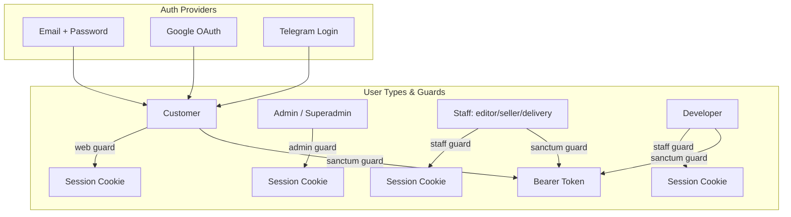
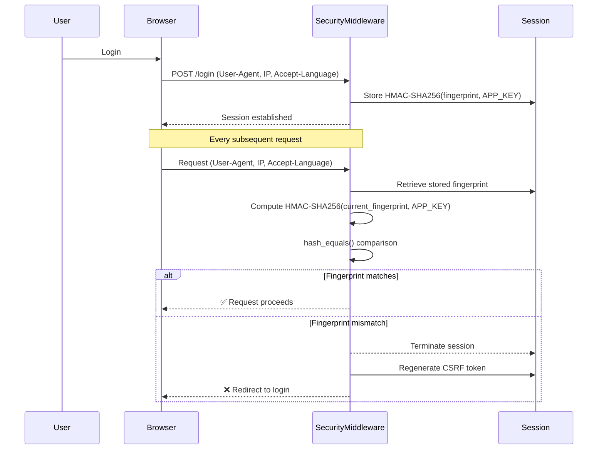
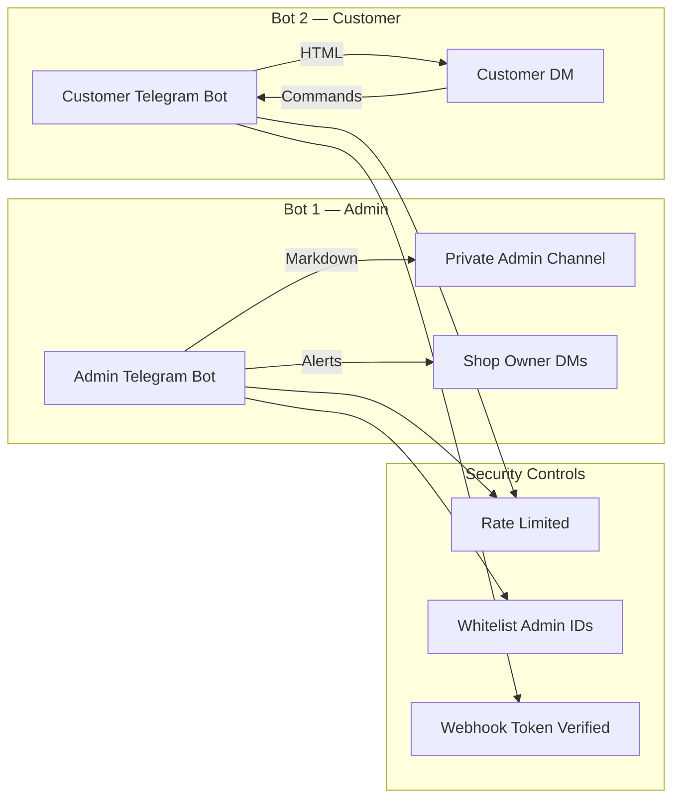

<!-- ============================================================
     TRONMATIX COMPUTER — Security Policy & Architecture
     ============================================================ -->

<div align="center">

<!-- ─── ANIMATED HERO SVG ───────────────────────────────────── -->
<svg viewBox="0 0 800 160" width="100%" height="auto" style="max-width:800px" xmlns="http://www.w3.org/2000/svg">
  <defs>
    <linearGradient id="secGrad" x1="0%" y1="0%" x2="100%" y2="100%">
      <stop offset="0%"   stop-color="#DC2626" />
      <stop offset="50%"  stop-color="#EF4444" />
      <stop offset="100%" stop-color="#DC2626" />
    </linearGradient>
    <linearGradient id="secGrad2" x1="0%" y1="0%" x2="100%" y2="0%">
      <stop offset="0%"   stop-color="#DC2626" stop-opacity="0" />
      <stop offset="50%"  stop-color="#EF4444" stop-opacity="0.5" />
      <stop offset="100%" stop-color="#DC2626" stop-opacity="0" />
    </linearGradient>
    <filter id="shieldGlow">
      <feGaussianBlur stdDeviation="4" result="blur"/>
      <feMerge><feMergeNode in="blur"/><feMergeNode in="SourceGraphic"/></feMerge>
    </filter>
  </defs>

  <!-- Background glow -->
  <circle cx="130" cy="80" r="60" fill="url(#secGrad2)" opacity="0.4">
  </circle>

  <!-- Shield icon -->
  <text x="130" y="100" font-size="64" text-anchor="middle" fill="url(#secGrad)" filter="url(#shieldGlow)">
    🛡️
  </text>

  <!-- Title -->
  <text x="280" y="75" font-size="44" font-family="'Segoe UI','Rajdhani',sans-serif"
        font-weight="900" fill="#DC2626" filter="url(#shieldGlow)">
    SECURITY
  </text>

  <!-- Subtitle -->
  <text x="280" y="108" font-size="20" font-family="'Segoe UI','Rajdhani',sans-serif"
        fill="#9CA3AF" font-weight="600">
    Security Architecture & Policy
  </text>

  <!-- Tagline -->
  <text x="280" y="132" font-size="14" font-family="'Segoe UI','Rajdhani',sans-serif"
        fill="#6B7280" font-style="italic">
    Defense in depth for the Cambodian e-commerce landscape
  </text>

  <!-- Animated underline -->
  <line x1="30" y1="150" x2="770" y2="150" stroke="url(#secGrad2)" stroke-width="2" stroke-linecap="round" />
  <circle cx="400" cy="150" r="4" fill="#EF4444">
  </circle>
</svg>

<br />

[](https://laravel.com/docs/security)
[](https://laravel.com/docs/authentication)
[](https://laravel.com/docs/sanctum)

</div>

---

## 📋 Table of Contents

1. [Overview](#-overview)
2. [Authentication Architecture](#-authentication-architecture)
3. [Session Security](#-session-security)
4. [Role-Based Access Control (RBAC)](#-role-based-access-control-rbac)
5. [Rate Limiting & Abuse Prevention](#-rate-limiting--abuse-prevention)
6. [API Security](#-api-security)
7. [Payment Security](#-payment-security)
8. [HTTP Security Headers](#-http-security-headers)
9. [Data Protection](#-data-protection)
10. [Telegram Security](#-telegram-security)
11. [Developer Portal Security](#-developer-portal-security)
12. [Reporting a Vulnerability](#-reporting-a-vulnerability)

---

## 📖 Overview

Tronmatix Computer implements **defense-in-depth** security across multiple layers — authentication, session management, authorization, request validation, and data protection. The system is designed to protect customer data, payment transactions, and administrative access for a Cambodian e-commerce platform.

<svg viewBox="0 0 800 120" width="100%" height="auto" style="max-width:800px" xmlns="http://www.w3.org/2000/svg">
  <defs>
    <linearGradient id="layerGrad" x1="0%" y1="0%" x2="100%" y2="0%">
      <stop offset="0%" stop-color="#059669"/>
      <stop offset="100%" stop-color="#10B981"/>
    </linearGradient>
    <linearGradient id="layerGrad2" x1="0%" y1="0%" x2="100%" y2="0%">
      <stop offset="0%" stop-color="#2563EB"/>
      <stop offset="100%" stop-color="#3B82F6"/>
    </linearGradient>
    <linearGradient id="layerGrad3" x1="0%" y1="0%" x2="100%" y2="0%">
      <stop offset="0%" stop-color="#7C3AED"/>
      <stop offset="100%" stop-color="#A78BFA"/>
    </linearGradient>
  </defs>

  <!-- Layer 1: Network -->
  <rect x="40" y="10" width="720" height="28" rx="6" fill="url(#layerGrad)" opacity="0.9">
  </rect>
  <text x="400" y="29" font-size="14" fill="#fff" text-anchor="middle" font-weight="bold">🌐 Network Layer</text>
  <text x="520" y="29" font-size="12" fill="#fff">HTTPS · Trusted Proxies · CORS · HSTS</text>

  <!-- Layer 2: Application -->
  <rect x="40" y="46" width="720" height="28" rx="6" fill="url(#layerGrad2)" opacity="0.9">
  </rect>
  <text x="400" y="65" font-size="14" fill="#fff" text-anchor="middle" font-weight="bold">🔐 Application Layer</text>
  <text x="530" y="65" font-size="12" fill="#fff">Multi-Guard Auth · RBAC · CSRF · Rate Limiting · Session Fingerprinting</text>

  <!-- Layer 3: Data -->
  <rect x="40" y="82" width="720" height="28" rx="6" fill="url(#layerGrad3)" opacity="0.9">
  </rect>
  <text x="400" y="101" font-size="14" fill="#fff" text-anchor="middle" font-weight="bold">🗄️ Data Layer</text>
  <text x="510" y="101" font-size="12" fill="#fff">Bcrypt Hashing · Input Validation · SQL Injection Prevention · Audit Logs</text>
</svg>

---

## 🔐 Authentication Architecture

### Multi-Guard System

The system uses **three separate authentication guards** to isolate concerns and limit blast radius:

| Guard | Type | User Model | Purpose | Cookie/Session Namespace |
|-------|------|------------|---------|-------------------------|
| `web` | Session + Cookie | `User` | Customer storefront login | `tronmatix_*` |
| `admin` | Session + Cookie | `Admin` | Blade dashboard access | `admin_*` |
| `staff` | Session + Cookie | `Staff` | Staff portal access | `staff_*` |
| `sanctum` | Token (Bearer) | All models | API authentication for React SPA & mobile | ` Sanctum token` |



### Password Security

| Setting | Value |
|---------|-------|
| **Hash Algorithm** | Bcrypt |
| **Cost Factor** | 12 rounds (configurable) |
| **Minimum Length** | 8 characters (validated by Fortify) |
| **Password Reset** | Token-based with expiration via Fortify |
| **Rate Limiting** | 5 attempts per minute per IP (login) |

### Social Authentication

- **Google OAuth 2.0**: Stateless callback with token exchange
- **Telegram Login**: Token-based authentication using Telegram's Login Widget flow
  - Generate temporary token → user authenticates via Telegram → poll for completion

### Ban Detection

The `not_banned` middleware runs on every protected API route:

```php
// app/Http/Middleware/EnsureNotBanned.php
public function handle($request, $next) {
    if ($request->user() && $request->user()->isBanned()) {
        // API: returns 403 JSON
        // Web: logs out and redirects to login
    }
    return $next($request);
}
```

---

## 🔒 Session Security

### Session Fingerprinting

The `SecurityMiddleware` implements **session hijacking prevention** through fingerprint binding:



Key implementation details:
- **Algorithm**: `HMAC-SHA256(User-Agent + IP + Accept-Language, APP_KEY)`
- **Timing-attack safe**: Uses PHP `hash_equals()` for constant-time comparison
- **Guard-namespaced**: Separate fingerprints for `web` and `admin` guards prevent cross-contamination
- **Except routes**: Login, register, password reset, and dashboard/login pages skip fingerprint checking

### Session Timeout & Rotation

| Feature | Setting | Location |
|---------|---------|----------|
| **Absolute Session Timeout** | 8 hours (configurable) | `SecurityMiddleware` |
| **Session ID Rotation** | Every 15 minutes | `SecurityMiddleware` |
| **Inactivity Timeout** | Configurable (default: none) | Laravel `config/session.php` |

```php
// Pseudocode from SecurityMiddleware
protected function enforceSessionTimeout($request) {
    $lastActivity = $request->session()->get($this->lastActivityKey);
    $timeout = config('session.lifetime', 480); // 8 hours in minutes

    if ($lastActivity && now()->diffInMinutes($lastActivity) > $timeout) {
        $this->terminateSession($request, 'Session timed out');
    }
    $request->session()->put($this->lastActivityKey, now());
}
```

### CSRF Protection

| Interface | Mechanism | Details |
|-----------|-----------|---------|
| **Blade Dashboard** | Laravel's built-in `@csrf` | Session-based, automatic on all POST/PUT/DELETE forms |
| **React SPA (API)** | Sanctum SPA authentication | `X-XSRF-TOKEN` cookie set by Sanctum |
| **React SPA (Token)** | No CSRF needed | Token-based auth is inherently CSRF-safe |

---

## 👮 Role-Based Access Control (RBAC)

### Roles

Six roles with progressively restricted access:

| Role | Level | Permissions | Dashboard Access |
|------|-------|-------------|-----------------|
| **superadmin** | 🔴 Top | Full system access, all permissions locked | Full Blade + React |
| **admin** | 🟠 High | All features except superadmin-only | Full Blade + React |
| **editor** | 🟡 Medium | Products, discounts, banners, reports | Blade + limited React |
| **seller** | 🟢 Medium | Products, orders, reports | Blade + limited React |
| **delivery** | 🔵 Low | Order status updates, delivery confirmation | Blade + limited React |
| **developer** | 🟣 Special | System health, logs, environment | Dev Portal only |

### Permission Matrix

Permissions are stored in the `admin_settings` table as `perm_{role}_{feature}` keys with boolean values.

| Feature | superadmin | admin | editor | seller | delivery | developer |
|---------|:----------:|:-----:|:------:|:------:|:--------:|:---------:|
| **Settings** | ✅ Locked | ✅ Locked | ❌ | ❌ | ❌ | ❌ |
| **Staff** | ✅ Locked | ✅ Locked | ❌ | ❌ | ❌ | ❌ |
| **Orders Edit** | ✅ Locked | ✅ Locked | ✅ | ✅ | ❌ | ❌ |
| **Users** | ✅ | ✅ | ❌ | ❌ | ❌ | ❌ |
| **Products** | ✅ | ✅ | ✅ | ✅ | ❌ | ❌ |
| **Discounts** | ✅ | ✅ | ✅ | ❌ | ❌ | ❌ |
| **Banners** | ✅ | ✅ | ✅ | ❌ | ❌ | ❌ |
| **Reports** | ✅ | ✅ | ✅ | ✅ | ❌ | ❌ |
| **Feedback** | ✅ | ✅ | ✅ | ✅ | ❌ | ✅ |

> **Locked permissions** (settings, staff, orders_edit for admin+) cannot be disabled even by superadmin — protecting critical system access.

### Permission Check Flow

```
Request → RoleMiddleware (API) / _permission_check.blade.php (Web)
  ↓
1. Determine user role ($_role)
  ↓
2. Superadmin? → Always granted (bypass)
  ↓
3. Look up perm_{role}_{feature} in admin_settings
  ↓
4. Not found in DB? → Fall back to AdminSetting::getDefaults()
  ↓
5. Denied? → 403 JSON (API) or access-denied partial (Blade)
```

### API Role Middleware

```php
// Route usage
Route::middleware('role:admin,superadmin,editor,seller,delivery,developer')
    ->group(function () {
        Route::get('/admin/stats', [AdminStatsController::class, 'stats']);
    });

Route::middleware('role:developer')->group(function () {
    Route::get('/dev/health', [DevToolsController::class, 'health']);
});
```

---

## 🚦 Rate Limiting & Abuse Prevention

| Endpoint Group | Limit | Period | Scope |
|---------------|-------|--------|-------|
| **Customer Login** | 5 attempts | 1 minute | Per IP |
| **Customer Registration** | 5 attempts | 1 minute | Per IP |
| **Staff Login** | 10 attempts | 1 minute | Per IP |
| **Developer Login** | 10 attempts | 1 minute | Per IP |
| **General API** | Configurable (throttle middleware) | Configurable | Per IP + Per User |
| **Payment Webhook** | Unlimited (IP-restricted) | — | ABA server IPs |

Rate limiting is implemented using Laravel's built-in `throttle` middleware:

```php
// Staff & Developer login — stricter rate limit
Route::middleware('throttle:10,1')->group(function () {
    Route::post('/staff/login', [StaffAuthController::class, 'login']);
    Route::post('/dev/login',   [DevAuthController::class,   'login']);
});
```

---

## 🔌 API Security

### Sanctum Token Auth

- **Token generation**: Personal Access Tokens created on login via `$user->createToken()`
- **Token storage**: `personal_access_tokens` table with hashed token
- **Token abilities**: Fine-grained scopes supported (currently used at route level via RoleMiddleware)
- **Instant revocation**: Delete token row from database — immediately effective
- **Stateless**: No session storage needed for API requests

### Request Validation

All API inputs are validated using Laravel Form Requests or inline `Validator`:

```php
// Example from AuthController
$request->validate([
    'email'    => 'required|email',
    'password' => 'required|string|min:8',
]);
```

### CORS Configuration

```php
// config/cors.php
'paths'          => ['api/*'],
'allowed_origins' => [
    env('FRONTEND_URL', 'http://localhost:3000'),
    env('APP_URL', 'http://localhost:8000'),
],
'allowed_methods' => ['*'],
'allowed_headers' => ['*'],
'supports_credentials' => env('SANCTUM_STATEFUL_DOMAINS') ? true : false,
```

### Axios Interceptors (Frontend)

The React SPA's Axios instance automatically:
- Attaches `Authorization: Bearer {token}` header
- Handles 401 responses → clears auth state → redirects to login
- Handles 419 (CSRF timeout) → redirects to login
- Handles network errors gracefully

---

## 💳 Payment Security

### Bakong KHQR (Cambodia QR Payment)

| Measure | Implementation |
|---------|---------------|
| **QR Generation** | Server-side via `pisethchhun/bakong-khqr-php` |
| **QR Expiration** | Timestamp-based, configurable TTL |
| **Deduplication** | `qr_md5` unique index prevents replay |
| **Transaction ID** | Unique `tran_id` per payment (unique index) |
| **Idempotent Webhook** | Webhook handler checks for existing transactions before processing |
| **Polling Safety** | Exponential backoff for payment status polling |

### ABA PayWay

| Measure | Implementation |
|---------|---------------|
| **Transaction Signing** | HMAC-SHA512 with merchant secret |
| **Merchant Auth** | RSA encryption for merchant authentication |
| **Webhook Validation** | Signature verification against ABA's spec |
| **No Card Storage** | Credit card data handled by ABA (PCI compliant) |

### Payment Status Lifecycle

```
Pending → Paid (successful webhook/manual confirmation)
       → Expired (QR timeout)
       → Failed (payment declined/error)
       → Manual Pending (requires staff verification)
       → Refunded (post-hoc refund)
```

---

## 🔧 HTTP Security Headers

The `SecurityHeadersMiddleware` applies these headers to all responses:

| Header | Value | Purpose |
|--------|-------|---------|
| `Strict-Transport-Security` | `max-age=2592000; includeSubDomains` | Enforce HTTPS for 30 days |
| `X-Frame-Options` | `SAMEORIGIN` | Prevent clickjacking |
| `X-Content-Type-Options` | `nosniff` | Prevent MIME sniffing |
| `Referrer-Policy` | `strict-origin-when-cross-origin` | Control referrer leakage |

Additionally, the middleware **removes server fingerprinting headers**:
- `X-Powered-By`
- `Server`
- `X-Generator`

```php
// Pseudocode from SecurityHeadersMiddleware
$response->headers->remove('X-Powered-By');
$response->headers->remove('Server');
$response->headers->set('X-Frame-Options', 'SAMEORIGIN');
$response->headers->set('X-Content-Type-Options', 'nosniff');
$response->headers->set('Strict-Transport-Security', 'max-age=2592000; includeSubDomains');
```

---

## 🔏 Data Protection

### Password Storage

- **Algorithm**: Bcrypt with 12 cost rounds
- **Automatic hashing**: Laravel's `Hash::make()` on all passwords via Eloquent mutator
- **No plaintext**: Passwords are never logged or exposed in API responses

### Input Validation

- **Server-side**: All inputs validated via Form Requests or Validator facade
- **SQL injection**: Prevented by Eloquent ORM's parameter binding
- **XSS**: Blade's `{{ }}` automatically escapes output; React's JSX handles encoding

### File Upload Security

| Feature | Implementation |
|---------|---------------|
| **Avatar Upload** | Validated for mime type (jpeg, png, webp, gif) |
| **Product Images** | UUID-based filenames prevent path traversal |
| **Storage Isolation** | Public uploads stored in `public/storage` with symbolic link |
| **Cloud Storage** | Optional S3/R2 with signed URLs |

### AdminSetting Cache

Sensitive settings are cached with a 5-minute TTL. On save, the cache is busted:

```php
// AdminSetting model
public static function get($key, $default = null)
{
    return Cache::remember("admin_setting_{$key}", 300, function () use ($key) {
        return self::where('key', $key)->value('value');
    });
}

public static function set($key, $value)
{
    Cache::forget("admin_setting_{$key}");
    return self::updateOrCreate(['key' => $key], ['value' => $value]);
}
```

---

## 🤖 Telegram Security

### Dual Bot Architecture



| Bot | Purpose | Format | Security |
|-----|---------|--------|----------|
| **Bot 1 (Admin)** | Real-time order alerts, payment confirmations, low stock warnings | Markdown | Admin chat_id whitelist, rate-limited |
| **Bot 2 (Customer)** | Order updates, delivery tracking, warranty info | HTML | Webhook token verification, per-user chat_id |

### User Telegram Connection Flow

```
1. User requests to connect Telegram
2. Server generates a unique connection token (UUID, expires in 15 min)
3. User sends /start <token> to the bot
4. Bot webhook receives the message and validates the token
5. Backend links telegram_chat_id to the user account
6. User receives order notifications via the bot
```

- **No sensitive data** is transmitted via Telegram messages
- **Separation of concerns**: Admin and customer bots use different API keys, preventing cross-contamination
- **Failure isolation**: Telegram API failures are wrapped in try-catch — never break the main request

---

## 👨‍🔧 Developer Portal Security

### Access Controls

| Layer | Protection |
|-------|-----------|
| **Route Protection** | `RoleMiddleware:developer` — only users with `role=developer` can access |
| **Login Rate Limit** | 10 attempts per minute per IP |
| **Artificial Delay** | 1-second delay on failed login attempts to slow brute-force attacks |
| **Secret Key** | Optional `.env` secret key (`DEV_PORTAL_KEY`) for additional gate |
| **Dev-only Endpoints** | Health check, log viewer, environment variables |

### Dev Portal Endpoints

| Endpoint | Data Exposed | Risk |
|----------|-------------|------|
| `/api/dev/health` | System health, uptime, DB status | Low |
| `/api/dev/logs` | Last 300 lines of `laravel.log` | 🔴 **Medium** — may contain stack traces |
| `/api/dev/env` | Environment variables (filtered) | 🔴 **High** — API keys masked |

Environment variable access filters sensitive values:
```php
// DevToolsController
$safeEnv = collect($_ENV)->map(function ($value, $key) {
    return str_contains($key, 'SECRET') || str_contains($key, 'KEY')
        ? '********'
        : $value;
});
```

---

## 🐛 Reporting a Vulnerability

We take security seriously. If you discover a security vulnerability within Tronmatix Computer, please follow these steps:

### Disclosure Policy

1. **Do not** disclose the vulnerability publicly (no GitHub issues, no social media)
2. **Email** the project maintainer with details
3. **Include**:
   - Type of vulnerability
   - Steps to reproduce
   - Affected version(s)
   - Potential impact
   - Suggested fix (if any)

### Response Timeline

| Timeframe | Action |
|-----------|--------|
| **0–24 hours** | Acknowledgment of receipt |
| **24–72 hours** | Initial assessment & severity classification |
| **3–7 days** | Fix development & internal testing |
| **7–14 days** | Patch release & disclosure |

### What to Expect

- **Confirmed vulnerability**: We'll develop a fix, credit you in the release notes (if desired), and publish a security advisory
- **Declined vulnerability**: We'll explain why it doesn't meet the threshold for a security issue
- **Questions**: We'll maintain communication throughout the process

---

## 📜 Security Checklist

- [x] Multi-guard authentication (web, admin, staff, sanctum)
- [x] Session fingerprinting (HMAC-SHA256)
- [x] Session timeout & rotation
- [x] CSRF protection (all state-changing operations)
- [x] Rate limiting (login, API, staff/dev portals)
- [x] Role-based access control (6 roles × 9 features)
- [x] Bcrypt password hashing (12 rounds)
- [x] Ban detection middleware
- [x] Security headers (HSTS, X-Frame-Options, X-Content-Type-Options)
- [x] Server fingerprint removal
- [x] CORS configuration
- [x] Input validation & sanitization
- [x] Eloquent ORM (SQL injection prevention)
- [x] Payment HMAC signing
- [x] Idempotent webhook handling
- [x] API token instant revocation
- [x] Developer portal protection
- [x] Telegram bot isolation
- [x] File upload validation
- [x] Environment variable protection

---

<div align="center">

<svg viewBox="0 0 800 30" width="100%" height="30" xmlns="http://www.w3.org/2000/svg">
  <defs>
    <linearGradient id="footerGrad" x1="0%" y1="0%" x2="100%" y2="0%">
      <stop offset="0%" stop-color="#DC2626" stop-opacity="0"/>
      <stop offset="50%" stop-color="#EF4444" stop-opacity="0.8"/>
      <stop offset="100%" stop-color="#DC2626" stop-opacity="0"/>
    </linearGradient>
  </defs>
  <line x1="0" y1="15" x2="800" y2="15" stroke="url(#footerGrad)" stroke-width="2"/>
  <circle cx="400" cy="15" r="4" fill="#EF4444">
  </circle>
</svg>

<br />

**Tronmatix Computer** — *Security-first e-commerce for Cambodia*  
_Phnom Penh · 2026_

[](https://laravel.com)
[](https://react.dev)

</div>
